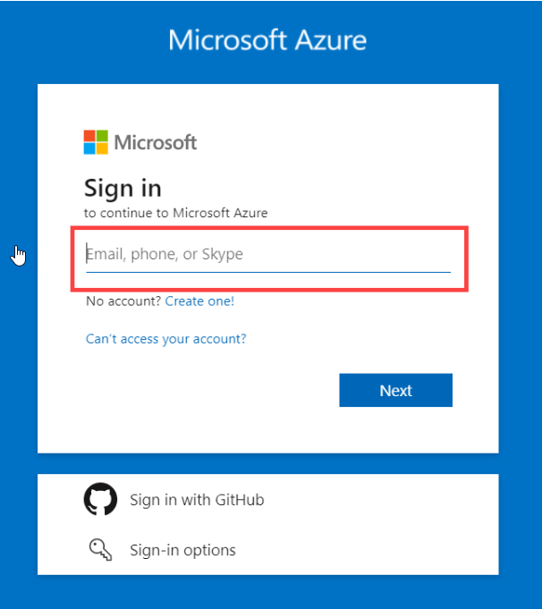
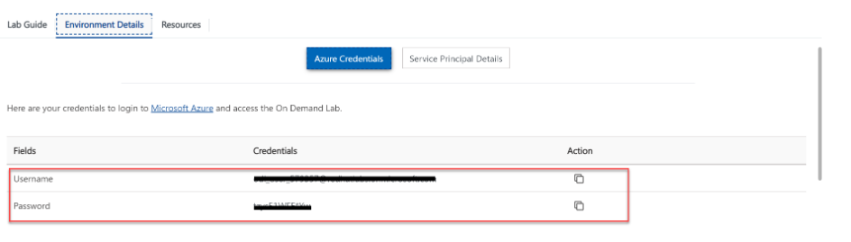
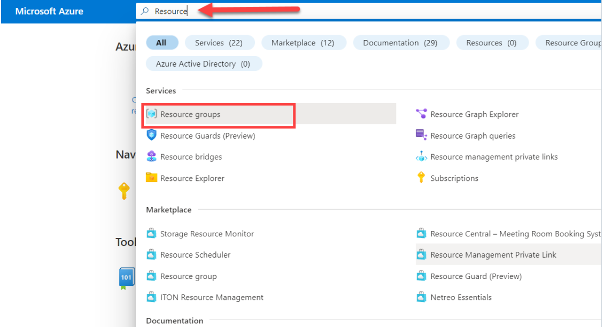
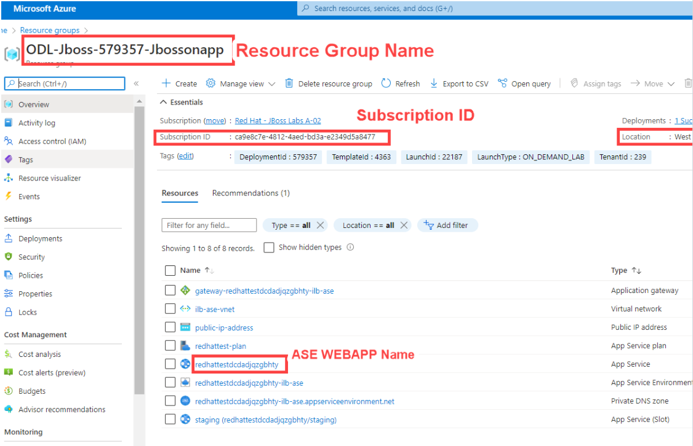

# 1 - Set up your environment

This workshop uses GitPod to provide a pre-configured development environment with Java, JBoss, and the Red Hat VS Code extensions ready-to-go! This section will guide you through the process of setting up a GitPod account and project :blush:.

## 1.1 - GitPod Setup

1. Fork [the workshop repository](https://github.com/Azure-Samples/workshop-migrate-jboss-on-app-service) into your personal GitHub account.
2. Go to [https://gitpod.io/](https://gitpod.io/) and create an account. You can use the Single-Sign-On to create a GitPod account from your GitHub account.

    

3. On the next screen, select **New Project**

    

    > Make sure you select **New Project** at this point, and not **New Workspace**.
    > Also make sure you select VS Code 1.76.0 Browser Latest:
    
     

4. Next, select **Authorize**

    

5. The next screen will ask which account(s) you want to authorize the application in. Select **your personal account**, which should be first in the list.

   

6. Then select your fork of the workshop repository, this will give GitPod permissions to read and write to your repo. Click **Install**.

   

7. On the next screen, select the **workshop-migrate-jboss-on-app-service** project.

    

8. Then select your personal account as the team to instantiate the project into.

    

9. Lastly, click **New workspace**. This will start the dev container and takes about one minute.

    

Once the workspace launches, you will have a cloud-based VS Code IDE!

## 1.2 - Sign into Azure

The exercises in this workshop will involve creating and configuring resources from the Azure CLI and Azure Portal. The GitPod workspace already has the Azure CLI installed, but you will have to sign in from the CLI.

1. Open the VS Code terminal in GitPod by going to the existing `bash` terminal:

    

2. Run the following command to get a device authorization code and open a browser tab to the device login page.

    ```bash
    az login --use-device-code & gp preview --external https://microsoft.com/devicelogin
    ```
    
    Copy the device login code from the terminal output and paste it into the device login page. Follow the instructions on the login page.

3. To confirm your CLI is authenticated, run the following command. This will output summary information about your Azure Subscription.

    ```bash
    az account show
    ```

> If you couldn't authenticate using the browser window, you can log in using your username and password directly in the command, `az login -u johndoe@contoso.com -p verySecretPassword`. This only works if your account does **not** have 2FA enabled.

## 1.2.1 - Locate Resources Name

* **Azure Portal:**

    To login to [Azure Portal](https://www.portal.azure.com/) . 

    

    Use the credential provided by Cloudlabs to Login.

    
    
    Go to [Azure Portal](https://portal.azure.com/) and search **Resource Groups**.

    
    
    Select **Resource Groups** and Note down the following values. (*You will be using the value further in the exercise*)

    * **Resource Group Name** : Your resource group name should look like `ODL-Jboss-XXXXXX-Jbossonapp`
    * **Subscription ID**
    * **Location**:
    * **ASE Webapp Name** : Your ASE Webapp Name should look like `redhattestXXXXXXX`

```
**TIP💡:** To know your resource group location code. Run the following command.
```  

```bash
az group show --name <Resource Group Name>
```



## 1.3 - Configure the workspace

Let's set some environment variables for later use. Press `F1` to open the command search window, and type `settings` into the search box, then select **Preferences: Open Workspace Settings (JSON)**. This will open a mostly empty file:


Replace the entire file with the below content, and then replace the placeholder values in `[]` with your unique values. Note that some of these must be globally unique, so consider adding your name or initials to them. You can optionally use a different `LOCATION` (the Azure region in which your resources will be deployed later on) if you want it to be closer to your geographic location.

> **HINT**: Valid values for `LOCATION` can be discovered by running `az account list-locations|jq '.[].name'` in the terminal.

> **HINT**: You can discover your Subscription ID with `az account show | jq -r .id`

```jsonc
{
    "terminal.integrated.env.linux": {
        // Provide the value which you noted down earlier
        "SUBSCRIPTION_ID": "[Your Azure Subscription ID]",

        //Provide the value which you noted down earlier
        //it should come like redhattestxxxxxxxx
        "ASE_WEBAPP_NAME": "[Paste the webapp name here]", 

        // these must be unique to you.
        "DB_SERVER_NAME": "[Unique-value]-postgres-database",
        "WEBAPP_NAME": "[Unique-value]-webapp",
        //Provide the value which you noted down earlier.
        "RESOURCE_GROUP": "[Resource-group-name]", 
        
        // the locatio should looks like eastus, westus, eastus2
        "LOCATION": "[Resource-group-location]",   

        // these are OK to be hard-coded
        "SERVICE_PRINCIPAL_NAME": "jboss-ase-sp",
        "DB_USERNAME": "cooladmin",
        "DB_PASSWORD": "EAPonAzure1"
    }
}
```

Save the file, then close your existing bash Terminal since it will not have these new settings (careful not to close the others!):


Next, open a new Terminal using the `＋` button and confirm the values are correct by running this command in the new Terminal:

```sh
for var in $(cat $GITPOD_REPO_ROOT/.vscode/settings.json \
    | grep -v '//' \
    | jq -r '."terminal.integrated.env.linux"
    | keys | join(" ")') ; do 
        val=$(eval echo \$$var); echo $var = $val
done
```


You should see the same values you entered. Now each new Terminal you open will have these settings. Some of the commands you run later in the workshop will reference these variables.

> **Warning:**
> 
> If you still see placeholder values instead of the values you entered into the JSON file, ensure that
> the file is saved by clicking into the file, and using `CTRL-S` (or `CMD-S` on a Mac), then close the
> newly-opened Terminal and open a new one and try the above command again until it shows correct values.


