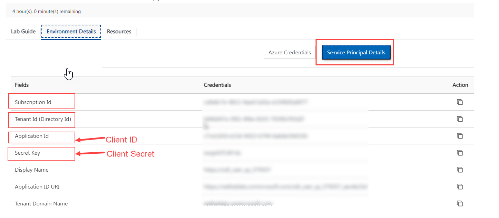

# 6 - The App Service Environment

## 6.1 - Overview of the App Service Environment

We have created an Azure Web App on the Premium V3 tier. The Premium V3 is a high-performance option for production applications, but for workloads that require even greater scale and security, there is the App Service Environment. The App Service Environment (ASE) is a single-tenant variant of App Service, meaning that the infrastructure components like the load balancers, storage, and VMs are dedicated to only your deployment.

### 6.1.1 - Internal and External ASE

ASE's can be deployed with an internet-routable IP address or deployed within a VNet, making its IP address accessible only from other resources within the virtual network:

- [External ASE](https://docs.microsoft.com/azure/app-service/environment/create-external-ase): The external ASE is conceptually similar to the multi-tenant App Service Plan, where the applications have an internet-routable IP address and default domain name.
- [Internal ASE](https://docs.microsoft.com/azure/app-service/environment/create-ilb-ase): Internally Load Balanced (ILB) ASEs are only accessible from within the VNet, but they can still be surfaced to the public internet through upstream devices such as a WAF. The ILB ASE is appropriate for hosting intranet applications securely in the cloud, or creating internet-isolated backend applications that your frontend apps can securely connect to.


### 6.1.2 - Features over multi-tenant App Service

App Service Environments are appropriate for applications that require:

- **Very high scale**: multi-tenant Plans can scale out up to 30 instances, whereas ASEs can scale to 200 instances.
- **Isolation and secure network access**: ASEs always exist in a virtual network, so you can granularly control inbound and outbound network connections.
- **High memory utilization**: The Isolated App Service Plans offer 2, 4, and 8 core machines with 8, 16, and 32 GB of memory respectively.
- **Zone redundancy**: ASEs can be [deployed into Availability Zones](https://azure.github.io/AppService/2019/12/12/App-Service-Environment-Support-for-Availability-Zones.html) to ensure a highly available deployment. Availability Zones are unique physical locations *within* an Azure Region. There are a minimum of three separate zones in supported regions, meaning if one zone suffers an outage, your applications will be available on the remaining zone.

## 6.2 - Exercise: Inspect your ILB ASE and Azure App Gateway

[Earlier in this workshop](1-environment-setup.md#1.4-deploy-the-app-service-environment) you created an App Service Environment using an ARM Template. This template deployed a few resources:

- A [Virtual Network](https://docs.microsoft.com/azure/virtual-network/virtual-networks-overview) with two subnets: one for the App Service Environment, and one for the App Gateway.
- An [App Service Environment](https://docs.microsoft.com/azure/app-service/environment/intro) with a private IP address, as well as an I1V2 App Service Plan, and a JBoss EAP web app.
- An [Application Gateway](https://docs.microsoft.com/azure/application-gateway/) to route traffic from a public IP address to the internal IP address of our ASE.


When the deployment template is complete, you can get the public IP address from the **Overview** section your App Gateway in the Portal. Browse to that IP address in the Portal and you should see the default landing page for your JBoss site! The following exercise will guide you through deploying to this network-isolated site.

## 6.3 - Exercise: Update Actions Workflow to deploy to ASE

Now that our site is secured behind an App Gateway within a Virtual Network, we cannot simply push our code from GitHub Actions as we did previously. Now we will need to update our GitHub Actions workflow to publish the artifacts to a Storage Account, and trigger the site to *pull* the artifacts from the Storage Account. The site is still allowed outbound access, so it is able to pull the code from storage.

First, we will need to update Service Principal so that our workflow can log into our Azure Subscription.

1. You can get the details of Service Pricipal from the CloudLabs page.
2. Open a browser to your fork of the repository on GitHub.
3. On the repository, go to **Settings** > **Secrets** > **New repository secret**.
4. Replace the values of **ClientID, ClientSecret, SubscriptionID, TenantID** with the values you get from CloudLabs - Service Principle details. It should look like this

```
**Tip💡:** Proceed to cloudlabs details and click on service principle to get the details.
```

**Note:** Replace the cliend id, client secret, subscription id, tenant id




```jsonc
{
  "clientId": "67b6cf14-0050-419b-a78e-d061e3a1394e",
  "clientSecret": "DTu._pEGE7LeU3ousQTGasSxwdBcxHP0U2-",
  "subscriptionId": "693eabcf-7fb7-4144-8da4-9ef27487ec90",
  "tenantId": "b84b647a-5f02-4f6e-8603-7059fa761d2f",

  "activeDirectoryEndpointUrl": "https://login.microsoftonline.com",
  "resourceManagerEndpointUrl": "https://management.azure.com/",
  "activeDirectoryGraphResourceId": "https://graph.windows.net/",
  "sqlManagementEndpointUrl": "https://management.core.windows.net:8443/",
  "galleryEndpointUrl": "https://gallery.azure.com/",
  "managementEndpointUrl": "https://management.core.windows.net/"
}
```
5. Under **Name**, enter `AZURE_CREDENTIALS`. Under **Value**, paste the output from the Azure CLI command you ran on step two.
6. Click **Add secret**

Now that the Service Principal is set as a secret in our repository, we can update our GitHub Actions workflow to use the credentials to log in.

1. Copy the template file, [`deploy-to-ilb-ase.yaml`](../templates/deploy-to-ilb-ase.yaml) and paste it as a new workflow file under `.github/workflows/depoy-to-ilb-ase.yaml`.
2. Replace the placeholders at the top of the file with your webapp name and resource group name.
3. Commit this as a new workflow file on the main branch and push these commits to your GitHub fork.

The commit to add the workflow file will also trigger it, so open your browser to the **Actions** tab of your repository to view the workflow's progress.

## 6.4 - Exercise: Connect the Web App to the PostgreSQL DB

Since this is a new web app, we will need to connect it to the Postrges database like in section 4. The GitHub Actions workflow will deploy the .WAR file, Postgres driver, and startup scripts. Since those files are deployed to the web app, the last thing to do is [set the necessary app settings](4-create-postgres-on-azure.md#4.3.1-create-application-settings) with the URL, username, and password. Run the command below to set the app settings.

```bash
az webapp config appsettings set -g $RESOURCE_GROUP -n $ASE_WEBAPP_NAME --settings \
  "POSTGRES_CONNECTION_URL=jdbc:postgresql://$SERVER_FQDN:5432/monolith?sslmode=require" \
  "POSTGRES_SERVER_ADMIN_FULL_NAME=${DB_USERNAME}@${DB_SERVER_NAME}" \
  "POSTGRES_SERVER_ADMIN_PASSWORD=$DB_PASSWORD"
```

## 6.5 - Resources

1. [Overview of ASEv3](https://docs.microsoft.com/azure/app-service/environment/overview)
2. [How-To configure App Gateway with an ILB ASE](https://docs.microsoft.com/azure/app-service/environment/integrate-with-application-gateway)
3. [How-To Deploy to Network-secured Web Apps](https://azure.github.io/AppService/2021/03/01/deploying-to-network-secured-sites-2.html)

---

